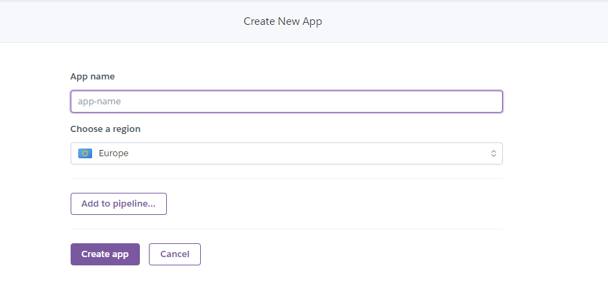
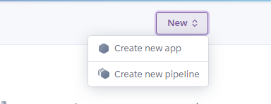
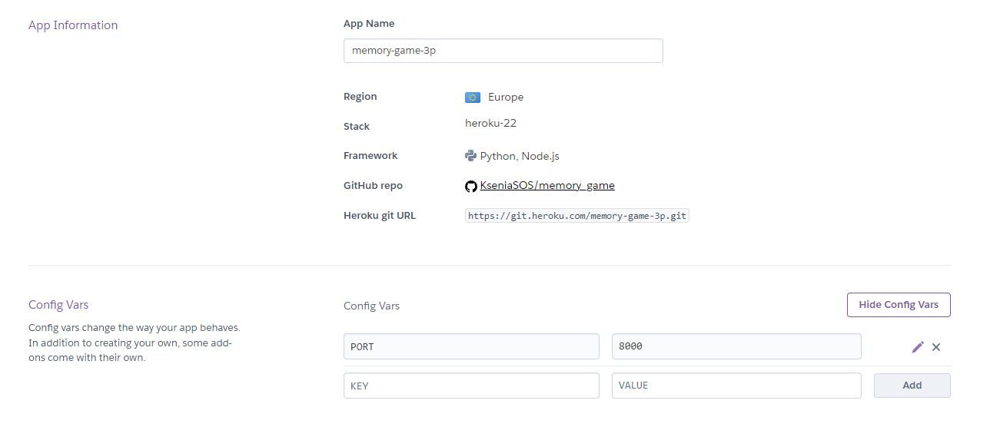
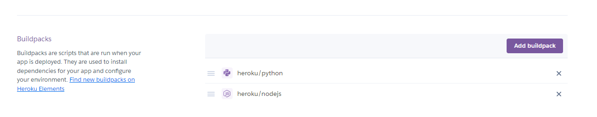

# **Memory Game**
Memory Game is a Python terminal game, which runs on Heroku. It is a simple logic game, where  users competes with computer, by finding all pairs of cards.

[View live website here](https://memory-game-3p-9d47756bf9a5.herokuapp.com/)

# Table of Content

* [**Project**](<#project>)
    * [Site Users Goal](<#site-users-goal>)
    * [User Stories](<#user-stories>)
    * [Site Owners Goal](<#site-owners-goal>)

* [**User Experience (UX)**](<#user-experience-ux>)
    * [Site Structure](<#site-structure>)
    * [Flow chart](<#flow-chart>)    
    * [Design Choices](<#design-choices>)

* [**Features**](<#features>)
    * [List Collection](<#list-collection>)

* [**Features Left To Implement**](<#features-left-to-implement>)

* [**Technologies Used**](<#technologies-used>)
    * [Languages](<#languages>)
    * [Frameworks, Librarys & Software](<#frameworks-libraries--software>)
    * [Python Packages](<#python-packages>)

* [**Testing**](<#testing>)
  * [Code Validation](<#code-validation>)
  * [Known Bugs](<#known-bugs>)
* [Deployment](<#deployment>)
* [Credits](<#credits>)
* [Acknowledgements](<#acknowledgements>)

# **Project**

## Site Users Goal

The user of "Memory Game" wants to play a round of a memory game with computer as an opponent.

## User Stories

Users:

* As a user I want to know the rules.    
* As a user I want to know if I choose the right card.
* As a user I want to know my score.

# **User Experience (UX)**

## Flow chart
The flow chart for this application was made with the online service Lucid App. A clear vision of the process helped to design a core model.

<b>Flow Chart</b>

 

[Back to top](<#table-of-content>)

## Site Structure

The 'Memory Game' is a terminal based application that is being presented in a one page website. When the application starts the user will be presented with a Logo and schort message if a user wants to continue.

## Design Choices

* ### Typography
No specific typography is being used in the application. The font is just the standard font that is being used in the terminal.

[Back to top](<#table-of-content>)

# **Features**
## **Existing Features**

* ### Welcome page
This is the entry point to the game. It is quite simple and consists a logo with a message.

  

* ### Enter Name
Then an app asks a user for a name.

  

[Back to top](<#table-of-content>)

* ### Rules
After entering a Name correctly, an app welcomes a player and displays a rules of the game.

  

[Back to top](<#table-of-content>)

* ### Main Board

 

*

 

[Back to top](<#table-of-content>)

* ### Input validation and error-checking

  

### Features Left to Implement

* 

[Back to top](<#table-of-content>)

# Technologies Used

## Languages

* [Python](https://en.wikipedia.org/wiki/Python_(programming_language)) - Provides the functionality for the application.

## Frameworks, Libraries & Software

* [PyCharm](https://www.jetbrains.com/pycharm/) - Used a local program on own PC
* [Gitpod](https://www.gitpod.io/#get-started) 
* [Github](https://github.com/) - Used to host and edit the website.
* [Heroku](https://en.wikipedia.org/wiki/Heroku) - A cloud platform that the application is deployed to.

## Python Packages

* [Time](https://docs.python.org/3/library/time.html) - A module that provides various time-related functions

[Back to top](<#table-of-content>)

# Testing

## Code Validation
The "Memory Game" has been tested through [PEP Online Validator](http://pep8online.com/).

[Back to top](<#table-of-content>)

### PEP Validation

<b>PEP Validation Result</b>

 

[Back to top](<#table-of-content>)

## Known bugs
### Fixed Bugs

*

# Deployment

## Deployment To Heroku

The project was deployed to [Heroku](https://www.heroku.com). To deploy, please follow the process below:

1. Log in to Heroku (or create an account if needed).

<b>Heroku Step 1</b>

 

2. Click on button to 'Create new app'.

<b>Heroku Step 2</b>

 

3. Enter an application name that needs to be unique. Enter the name, select your region and click 'Create app".

<b>Heroku Step 3</b>

 

4. On the next page, click the 'Settings' tab and find the "Config Vars" section. Click on "Reveal Config Vars" button. Using uppercase letters add 'PORT' to the key box and '8000' to the value box.
Click 'Add'.

<b>Heroku Step 4</b>

 

5. Scroll down to the buildpacks section on the settings page and click the button 'Add buildpack'.

<b>Heroku Step 5</b>

 

6. Add "Python" and node.js". It is important that Python is listed above node.js. If it's not you can sort it by dragging and dropping.

<b>Heroku Step 6</b>

 

7. For deployment, scroll to the top of the settings page and click the 'Deploy' tab. For deployment method, select 'Github'. Search for the repository name you want to deploy and then click connect.

8. Scroll down on the deploy page and choose deployment type. Choose to enable automatic deployments if you want to and then click 'Deploy Branch'.

<b>Heroku Step 8</b>

 

The link to the "Memory Game" Github repository can be found [here](https://github.com/KseniaSOS/memory_game).

[Back to top](<#table-of-content>)

## How To Fork The Repository On GitHub

A copy of the GitHub Repository can be made by forking the GitHub account. This copy can be viewed and changes can be made to the copy without affecting the original repository. Take the following steps to fork the repository:

1. Log in to **GitHub** and locate the [repository](https://github.com/KseniaSOS/memory_game).
2. On the right hand side of the page inline with the repository name is a button called **'Fork'**, click on the button to create a copy of the original repository in your GitHub Account.

<b>Github Fork</b>

 

[Back to top](<#table-of-content>)

## Create A Local Clone of A Project

The method for cloning a project from GitHub is described below:

1. Under the repository’s name, click on the **code** tab.
2. In the **Clone with HTTPS** section, click on the clipboard icon to copy the given URL.
3. In your IDE of choice, open **Git Bash**.
4. Change the current working directory to the location where you want the cloned directory to be created.
5. Type **git clone**, and then paste the URL copied from GitHub.
6. Press **enter** and the local clone will be created.

<b>Github Create Local Clone</b>

 

[Back to top](<#table-of-content>)

# Credits

* [Real Python](https://realpython.com/lessons/how-and-when-use-str/) - 'How and When to use _ str _' 
* [Geeks for Geeks](https://rb.gy/rt2wz) - Using @property decorators 
* [ASCII Art Generator](http://patorjk.com/software/taag/#p=display&h=0&v=2&f=Dancing%20Font&t=memory%20%0A%20%20game) - This ASCII generator was used to create the game logo 
* [ASCII Art ](https://www.asciiart.eu/) - This ollection of ASCII art drawings was used for cards images
* [Lucid](https://lucid.app/) - There was made a flow chart for this project 
* [Am I Responsive?](https://ui.dev/amiresponsive) - Responsive deisign image

[Back to top](<#table-of-content>)

# Acknowledgements

I would like to acknowledge the Code Institute for the opportunity to work on such a project. It has been a challenging experience, but I have learned a lot. Special thanks goes to my family for their continued support, motivation and patience.

[Back to top](<#table-of-content>)

